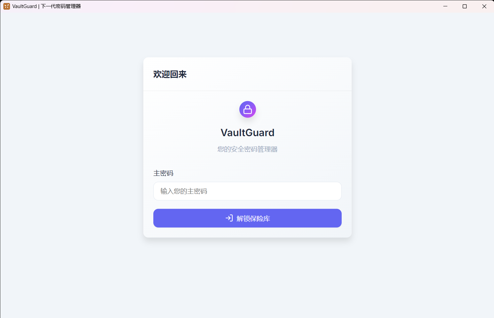
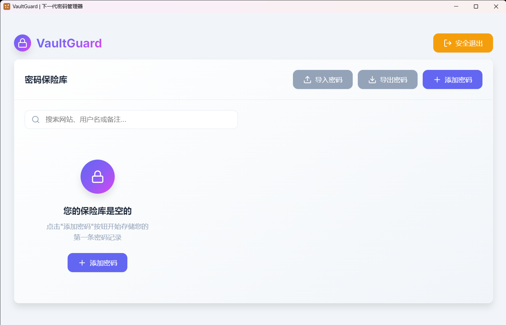
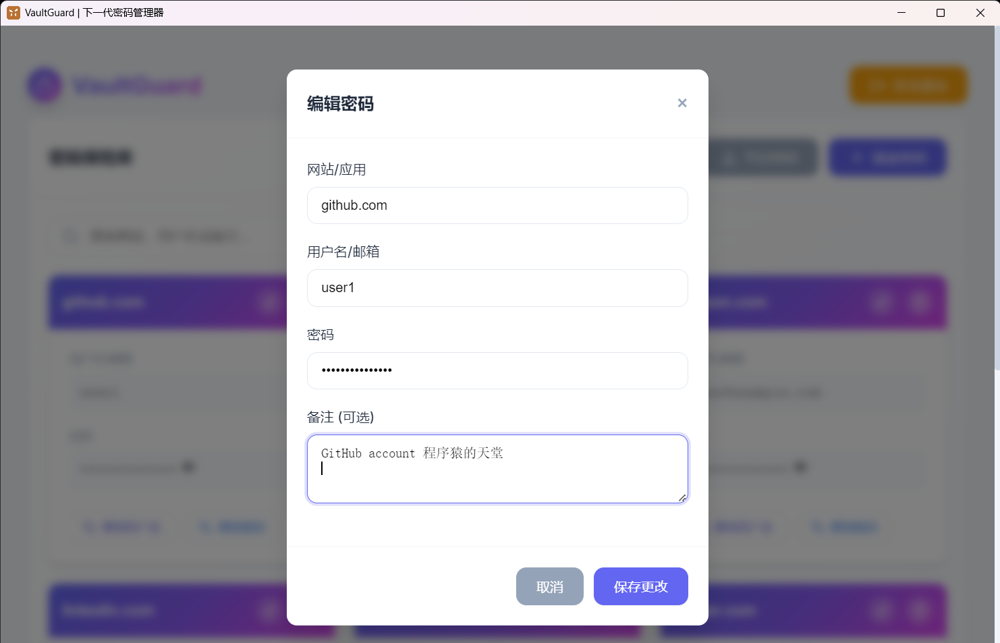
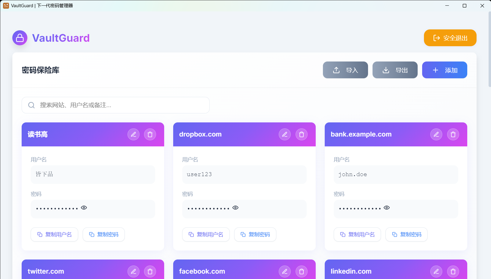
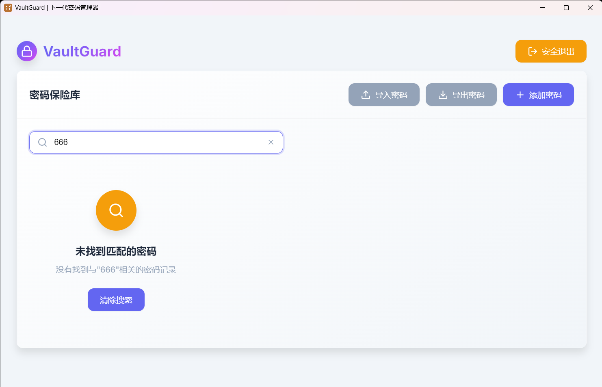
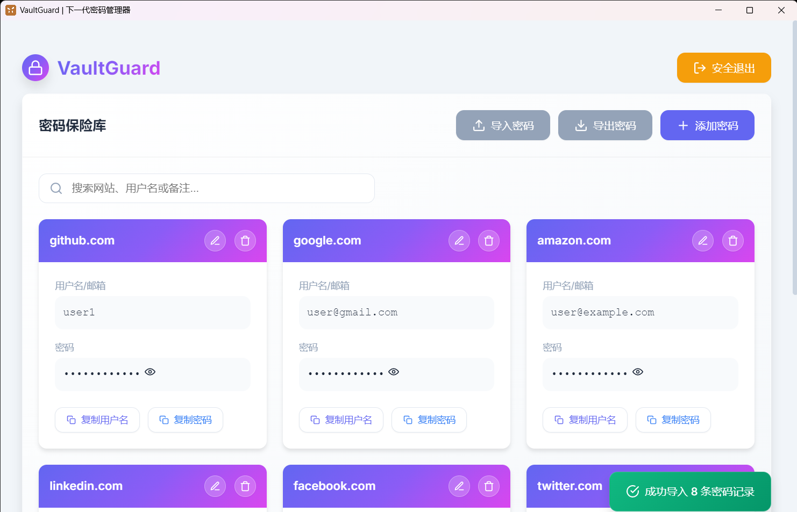

# VaultGuard - 安全密码管理器



VaultGuard是一款基于Electron开发的现代化密码管理器，专注于为用户提供安全、便捷的密码存储和管理服务。

## 功能特点


### 🔐 安全加密存储
- 使用AES-256-CBC加密算法保护您的密码数据
- 主密码保护机制，只有您知道主密码才能访问数据
- 数据本地存储，不上传到任何服务器
  


### 📋 密码管理
- 添加、编辑、删除密码条目
- 支持网站/应用名称、用户名、密码和备注信息
- 直观的卡片式界面展示所有密码
  


### 🔍 搜索功能
- 快速搜索功能，轻松找到需要的密码条目
- 支持按网站、用户名或备注搜索



### 📤 导入/导出
- 支持Excel和CSV格式导入密码
- 支持导出密码到Excel或CSV文件
- 方便在不同设备间迁移数据
  


### 🧹 批量操作
- 一键清空整个密码库（谨慎使用）
- 确认机制防止误操作

### 🎨 现代化界面
- 响应式设计，适配不同屏幕尺寸
- 深色模式支持
- 流畅的动画效果和交互体验

## 技术架构

- **框架**: Electron 21.0.0
- **前端**: HTML5, CSS3, JavaScript
- **加密库**: Node.js crypto模块
- **数据处理**: xlsx 0.18.5
- **构建工具**: electron-builder 26.0.12

## 安装与运行

### 开发环境
```bash
# 克隆项目
git clone https://github.com/izhagons/VaultGuard.git

# 进入项目目录
cd VaultGuard

# 安装依赖
npm install

# 启动应用
npm start
```

### 构建应用
```bash
# 构建可执行文件
npm run build
```

## 使用说明

1. **初始化**: 首次运行需要设置主密码，该密码将用于加密所有存储的密码
2. **登录**: 每次启动应用都需要输入主密码解锁密码库
3. **添加密码**: 点击"添加"按钮创建新的密码条目
4. **查看密码**: 点击密码字段可切换显示/隐藏状态
5. **编辑密码**: 点击编辑按钮修改密码条目
6. **删除密码**: 点击删除按钮移除密码条目
7. **导入/导出**: 使用导入/导出功能管理数据
8. **清空密码库**: 使用清空按钮删除所有密码（需要确认）

## 安全提醒

- 请务必记住您的主密码，一旦遗忘将无法恢复数据
- 建议使用强密码作为主密码（包含大小写字母、数字和特殊字符）
- 定期备份您的密码数据
- 不要在公共场合展示您的密码

## 许可证

ISC License

## 作者

zhagons
